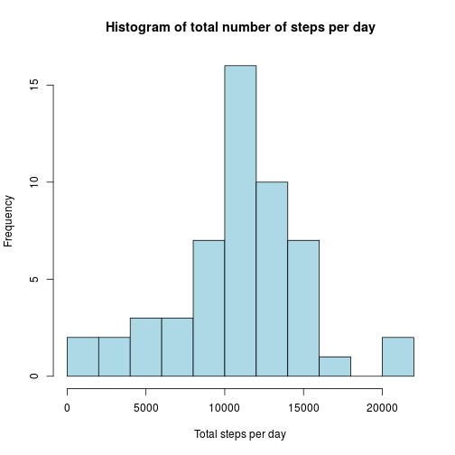
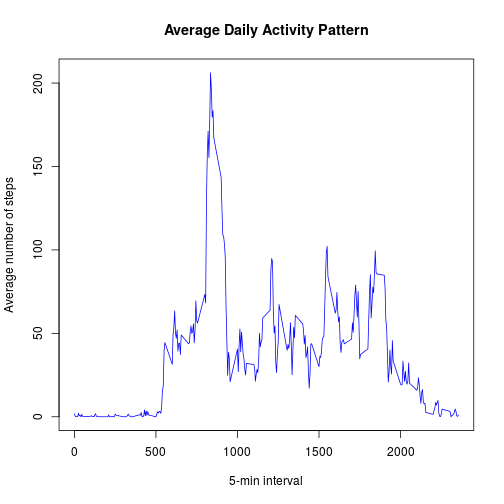
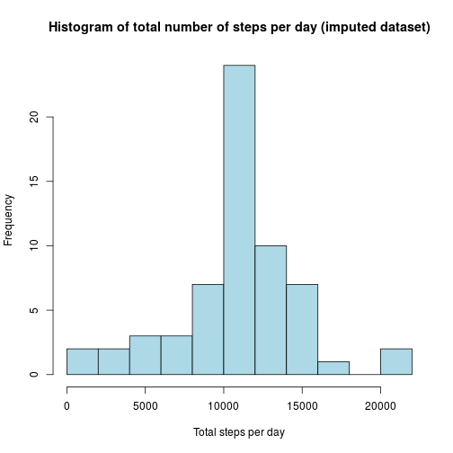
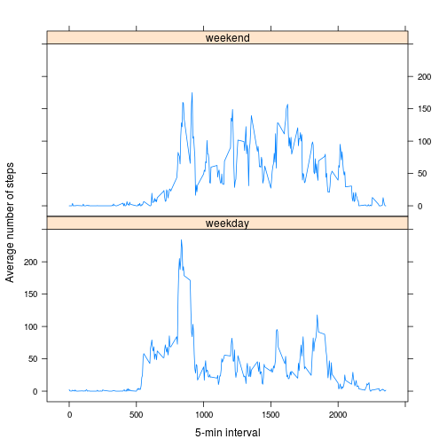

## Loading and preprocessing the data

```r
data <- read.csv("activity.csv")
# by default aggregate ignores NAs
total_steps_per_day <- aggregate(steps~date, data=data, sum) 
steps_per_interval <- aggregate(steps~interval, data=data, mean)
```
  
  
## What is mean total number of steps taken per day?
### 1. Make a histogram of the total number of steps taken each day

```r
hist(total_steps_per_day$steps, breaks = 12, col = "lightblue",
     main = "Histogram of total number of steps per day", xlab="Total steps per day")
```

 

### 2. Calculate and report the mean and median total number of steps taken per day

```r
mean(total_steps_per_day$steps)
```

```
## [1] 10766.19
```

```r
median(total_steps_per_day$steps)
```

```
## [1] 10765
```
  
  
  
## What is the average daily activity pattern?
### 1. Make a time series plot (i.e. type = "l") of the 5-minute interval (x-axis) and the average number of steps taken, averaged across all days (y-axis)


```r
plot(type = "l", col = "blue",
     x = steps_per_interval$interval, xlab="5-min interval", 
     y = steps_per_interval$steps,  ylab="Average number of steps",
     main = "Average Daily Activity Pattern")
```

 

### 2. Which 5-minute interval, on average across all the days in the dataset, contains the maximum number of steps?

```r
steps_per_interval$interval[which.max(steps_per_interval$steps)]
```

```
## [1] 835
```
(that is the interval between 0835 and 0840)
  
  
  
## Imputing missing values
  
  
### 1. Calculate and report the total number of missing values in the dataset (i.e. the total number of rows with NAs)

```r
# number of incomplete cases, i.e. rows with missing values
sum(complete.cases(data) == FALSE)
```

```
## [1] 2304
```

### 2. Devise a strategy for filling in all of the missing values in the dataset. The strategy does not need to be sophisticated. For example, you could use the mean/median for that day, or the mean for that 5-minute interval, etc.

Missing values for steps in the dataset will be imputed by the mean for the corresponding 5-minute interval.
  
  
### 3. Create a new dataset that is equal to the original dataset but with the missing data filled in.

```r
# collect all NAs
NAs <- is.na(data$steps)
to_impute <- data[NAs,]

# make the intervals match the corresponding intervals in steps_per_interval
steps_per_interval$interval <- factor(steps_per_interval$interval)
to_impute$interval <- factor(to_impute$interval, levels(steps_per_interval$interval))

# impute the NA steps with the corresponding means
to_impute$steps <- steps_per_interval$steps[to_impute$interval]

# construct the imputed dataset
data_imputed <- data
data_imputed$steps[NAs] <- to_impute$steps

## shorter (but maybe less clear?)
#data_imputed<-data
#data_imputed$interval <- factor(d$interval, levels(steps_per_interval$interval))
#data_imputed$steps[NAs] <- steps_per_interval$steps[data_imputed$interval[NAs]]
```
  
  
### 4. Make a histogram of the total number of steps taken each day and Calculate and report the mean and median total number of steps taken per day. Do these values differ from the estimates from the first part of the assignment? What is the impact of imputing missing data on the estimates of the total daily number of steps?


```r
total_steps_per_day_imp <- aggregate(steps~date, data=data_imputed, sum)
hist(total_steps_per_day_imp$steps, breaks = 12, col = "lightblue",
     main = "Histogram of total number of steps per day (imputed dataset)", xlab="Total steps per day")
```

 

```r
mean(total_steps_per_day_imp$steps)
```

```
## [1] 10766.19
```

```r
median(total_steps_per_day_imp$steps)
```

```
## [1] 10766.19
```

As we can see above the histogram has a higher frequency of values in the middle and lower on the tails.
The mean stays the same and the median becomes the mean.
  
  
  
## Are there differences in activity patterns between weekdays and weekends?

```r
require(lattice)
```

```
## Loading required package: lattice
```

```r
# we want english day names
Sys.setlocale("LC_TIME", "en_US.UTF-8")
```

```r
day_of_week <- factor(weekdays(strptime(data$date, format="%Y-%m-%d")))
weekend=c("Saturday", "Sunday")
weekend_days <- which(day_of_week %in% weekend)
steps_on_weekends <- aggregate(steps~interval, data=data[weekend_days,], mean)
steps_on_weekdays <- aggregate(steps~interval, data=data[-weekend_days,], mean)
steps_wday <- rbind(data.frame(steps_on_weekdays, partition=factor("weekday")),
                    data.frame(steps_on_weekends, partition=factor("weekend")))
xyplot(data=steps_wday, steps~interval|partition, layout=c(1,2), type="l",
       xlab="5-min interval", ylab="Average number of steps")
```

 

